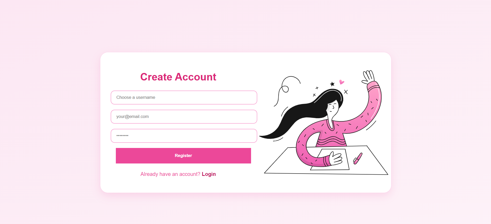
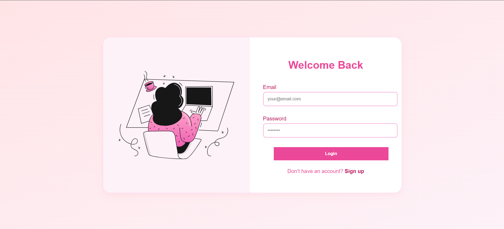
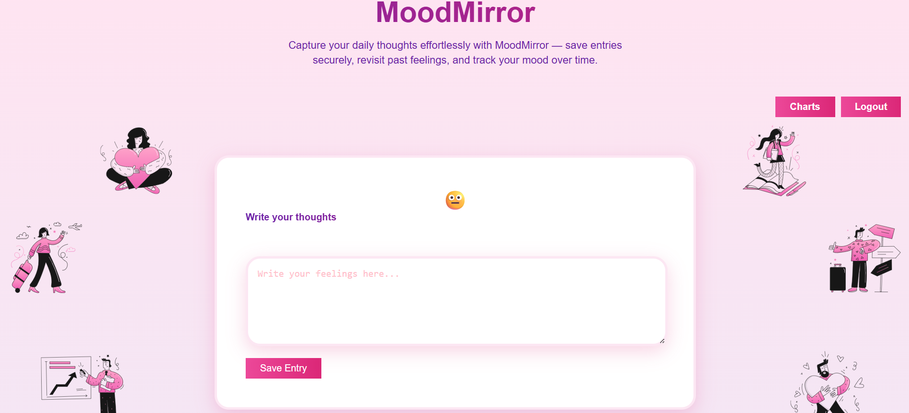
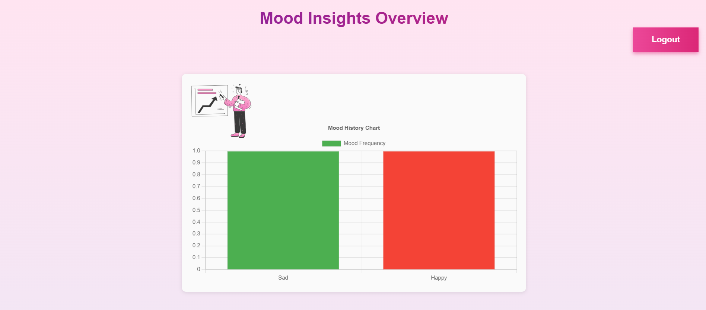

# MoodMirror

MoodMirror is a full-stack web application designed to help users reflect on their daily emotions, track mood patterns, and gain insights through visual representations. Built using React.js for the frontend and Node.js with Express.js for the backend, it provides a seamless diary experience integrated with emotion recognition.

---

## ✨ Table of Contents

- [🌟 Aim](#-aim)
- [🔎 Features](#-features)
- [🚀 Tech Stack](#-tech-stack)
- [📊 Libraries Used](#-libraries-used)
- [📷 Screenshots](#-screenshots)
- [🎥 Demo](#-demo)

---

## 🌟 Aim

To provide users with a private, intuitive space to express their daily feelings, automatically detect their mood tone, and offer reflective insights via emotion-based graphs.

---

## 🔎 Features

- Mood-based diary entry submission  
- Emotion detection using a keyword-based logic  
- Data visualization using charts (Chart.js)  
- Mood history timeline and graphs  
- Backend API for storing and retrieving diary entries  
- Responsive and minimal UI with relevant mood images  
- Authentication-free usage for fast access (can be extended)

---

## 🚀 Tech Stack

- **Frontend**: React.js, HTML, CSS, JavaScript  
- **Backend**: Node.js, Express.js  
- **Charts**: Chart.js (for animated mood graphs)  
- **Deployment**: GitHub Pages (Frontend) + Replit (Backend)

---

## 📊 Libraries Used

- [`chart.js`](https://www.chartjs.org/): For animated mood visualizations  
- `express`: Backend routing and server logic  
- `cors`, `body-parser`: Middleware for API handling

---

## 📷 Screenshots

  
  
  
  
  

  
  

---

## 🎥 Demo

[▶️ Watch Demo Video](https://drive.google.com/file/d/1C0F_08QlDqVozn3m3j-NIWb0gKqYqGif/view?usp=drive_link)

---

> Feel free to fork the repo, suggest improvements, or contribute!  
> This app was built as a personal project for emotional reflection and full-stack learning.
